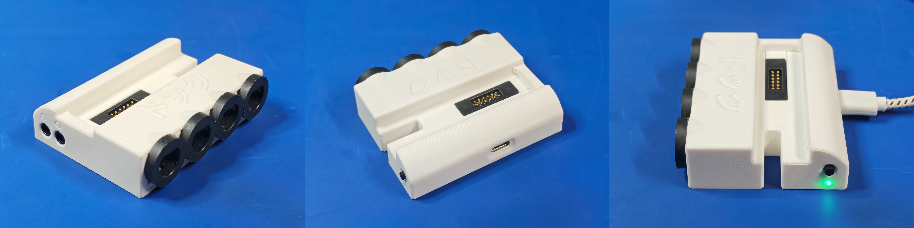

<picture> <source media="(prefers-color-scheme: dark)" srcset="images/kawaii_logo_white.png">  </picture> 

Kawaii is a functional metal Nintendo Wii keychain created by YveltalGriffin, Wesk and Ding.

It's a technical tour de force that prioritizes aesthetics over practicality, and **fully** utilizes the OMEGA trim.

Kawaii may be the zenith of Wii portablizing as an artform.
  

## Features:
- [x] 60 x 60 x 15.8mm CNC aluminum chassis
- [x] Anodized, with laser-etched artwork
- [x] Fake compliance markings
- [x] Keychain / tassel loop
- [x] OMEGA-trimmed undervolted Hollywood-2 Wii Mini motherboard
- [x] [AVEflex](https://github.com/mackieks/AVEflex) and [nandFlex](https://github.com/mackieks/nandFlex)
- [x] Powered by [Thundervolt](https://github.com/mackieks/thundervolt)
- [x] Internal microSD card for homebrew and games
- [x] Six internal addressable RGB LEDs
- [x] Magnetic pogo pin docking connector
- [x] Composite video, 480p YPbPr, and stereo audio output
- [x] 4-player GameCube controller connectivity via magnetic dock

## Gallery

## Building One

Kawaii is 100% open source, but due to the extremely challenging nature of the build, no assembly guide or build tutorial is provided. Keep in mind that this project is **portablizer jewelry** (it's literally a keychain) and **NOT** a console you want to daily drive.

Check out the hardware folder for all of the MCAD, ECAD, and BOM files. A full MCAD assembly is provided in both F3D and STEP format, which shows how everything fits together. The [BitBuilt thread](https://bitbuilt.net/forums/index.php?threads/kawaii.6474/) has lots of pictures from the assembly process of two Kawaiis and is another valuable resource. 

List of Kawaii components:
- [x] CNC machined, anodized, and laser-etched aluminum shell (two pieces)
- [x] Hollywood-2 Wii Mini OMEGA trim, [AVEflex](https://github.com/mackieks/AVEflex), [nandFlex](https://github.com/mackieks/nandFlex), and [Thundervolt](https://github.com/mackieks/thundervolt)
- [x] Internal kawaiiSD PCB
- [x] Pogo pin riser PCB
- [x] RGB LED PCB
- [x] MHF4 female pigtails [link](https://www.aliexpress.us/item/3256802754472981.html)
- [x] 3D-printed lightpipes (x2)
- [x] 12-pin magnetic pogo pin connector [link](https://www.aliexpress.us/item/3256804525551011.html)
- [x] Various fasteners (see MCAD)

List of dock components:
- [x] 3D-printed dock (three pieces)
- [x] Dock PCB (including four trimmed/cleaned-up Wii GCC ports)
- [x] LED lightpipe (PLPC2-100)
- [x] Various fasteners (see MCAD)

Miscellaneous assembly/usage notes:
- [x] A heavily-undervolted Hollywood-2 Wii Mini is mandatory. A Hollywood-1, or any variant at stock voltages, will run way too hot
- [x] Unless you live in Alaska or Siberia, the unit will need an external source of airflow (fan, AC, open window, etc.) to stay cool enough to touch during operation
- [x] Use 0.5mm foam tape to secure the RGB LED PCB to the Kawaii shell
- [x] Use a file to post-process the Wii GCC ports. They have to be really uniform and square to fit into the shell properly (see thread)
- [x] Use a camcorder pinout 3.5mm-to-RCA cable for A/V. Check the schematic for pinout details. [link](https://www.amazon.com/dp/B08V1SV8BL)
- [x] Use a Samsung / LG pinout 3.5mm-to-component cable for YPbPR. Check the schematic for pinout details. [link](https://www.amazon.com/dp/B09ZJTZ5NL)

## World's Smallest?

Whether the Kawaii is the world's smallest functioning Wii is up for debate. Since it requires a dock or bundle of adapter cables to function, it's certainly not the world's smallest _fully self-contained_ Wii— that's still loopj's [Short Stack](https://github.com/loopj/short-stack). Kawaii also requires an external fan to stay cool enough to touch during extended use.

Still, the Kawaii does contain a complete Wii. Its only inputs are power and GameCube controllers, and its only outputs are analog audio and video. So it may be the smallest functional Wii build, but not the smallest functional Wii console. The distinction is semantic and largely irrelevant to the project's goal, which was to create something beautiful, not to claim a title. 😄

## Credits

- YveltalGriffin: Concept, ECAD, MCAD, artwork, assembly
- Wesk: MCAD, sexy renders
- Ding: CNC machining, anodization, laser etching
