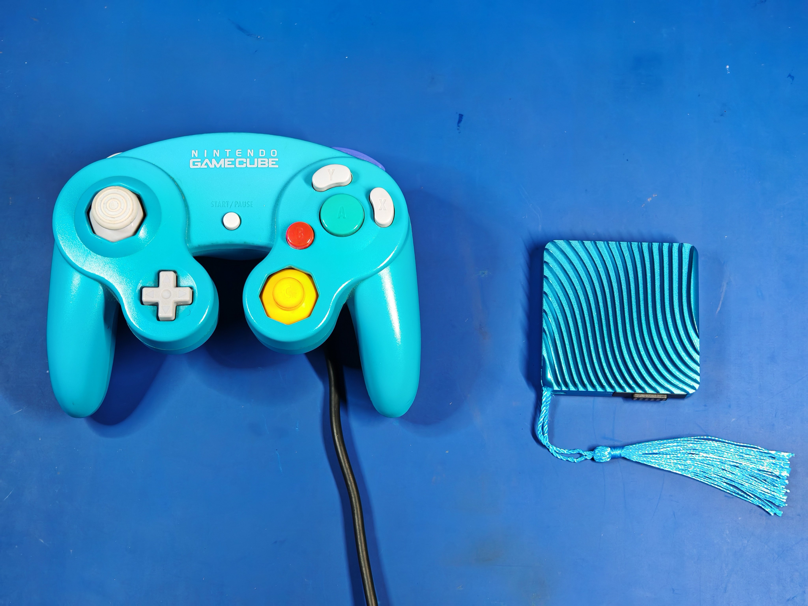

<picture> <source media="(prefers-color-scheme: dark)" srcset="images/kawaii_logo_white.png">  </picture> 

Kawaii is a functional metal Nintendo Wii keychain created by YveltalGriffin, Wesk and Ding.

It's a technical tour de force that prioritizes aesthetics over practicality, and **fully** utilizes the OMEGA trim.

Kawaii may be the zenith of Wii portablizing as an artform.
  

## Features:
- [x] 60 x 60 x 15.8mm CNC aluminum chassis
- [x] Anodized, with laser-etched artwork
- [x] Fake compliance markings
- [x] Keychain / tassel loop
- [x] OMEGA-trimmed undervolted Hollywood-2 Wii Mini motherboard
- [x] [AVEflex](https://github.com/mackieks/AVEflex) and [nandFlex](https://github.com/mackieks/nandFlex)
- [x] Powered by [Thundervolt](https://github.com/mackieks/thundervolt)
- [x] Internal microSD card for homebrew and games
- [x] Six internal addressable RGB LEDs
- [x] Magnetic pogo pin docking connector
- [x] Composite video, 480p YPbPr, and stereo audio output
- [x] 4-player GameCube controller connectivity via magnetic dock

## Gallery

## Building One

Kawaii is 100% open source, but due to the extremely challenging nature of the build, no assembly guide or build tutorial is provided. Keep in mind that this project is **portablizer jewelry** (it's literally a keychain) and **NOT** a console you want to daily drive.

Check out [the hardware folder](https://github.com/mackieks/Kawaii/tree/main/hardware) for all of the MCAD, ECAD, and BOM files. A full MCAD assembly is provided in both F3D and STEP format, which shows how everything fits together. The [BitBuilt thread](https://bitbuilt.net/forums/index.php?threads/kawaii.6474/) has lots of pictures from the assembly process of two Kawaiis and is a valuable resource. 

## World's Smallest?

Whether the Kawaii is the world's smallest functioning Wii is up for debate. Since it requires a dock or bundle of adapter cables to function, it's certainly not the world's smallest _fully self-contained_ Wii— that's still loopj's [Short Stack](https://github.com/loopj/short-stack). Kawaii also requires an external fan to stay cool enough to touch during extended use.

Still, the Kawaii does contain a complete Wii. Its only inputs are power and GameCube controllers, and its only outputs are analog audio and video. So it may be the smallest functional Wii build, but not the smallest functional Wii console. The distinction is semantic and largely irrelevant to the project's goal, which was to create something beautiful, not to claim a title. 😄

## Credits

- YveltalGriffin: Concept, ECAD, MCAD, artwork, assembly
- Wesk: MCAD, sexy renders
- Ding: CNC machining, anodization, laser etching
